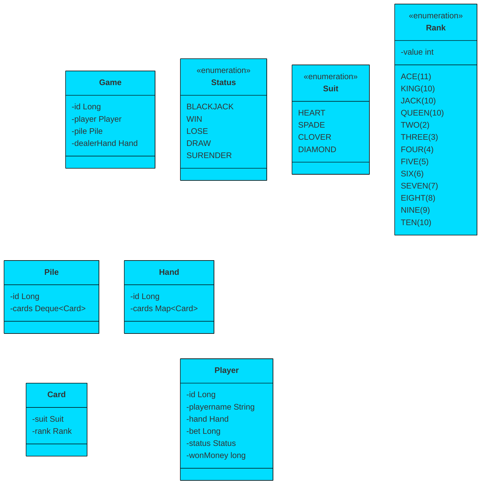

### Mermaid Class Diagram

```mermaid
%%{init: {
    'theme': 'base', 
    'themeVariables': { 'primaryColor': '#00ddff', 'primaryBorderColor': '#000000', 'lineColor': '#ffffff'}
    }
}%%

classDiagram

    Game *-- Pile
    Game *-- Player
    Game *-- Hand
    Hand --* Card
    Pile --* Card
    Hand --* Player


    class Status{
    <<enumeration>>
    BLACKJACK
    WIN
    LOSE
    DRAW
    SURENDER
    }
    class Suit{
    <<enumeration>>
    HEART
    SPADE
    CLOVER
    DIAMOND
    }
    class Rank{
    <<enumeration>>
    -value int
    ACE(11)
    KING(10)
    JACK(10)
    QUEEN(10)
    TWO(2)
    THREE(3)
    FOUR(4)
    FIVE(5)
    SIX(6)
    SEVEN(7)
    EIGHT(8)
    NINE(9)
    TEN(10)
    }
    
    class Game{
    -id Long
    -player Player
    -pile Pile
    -dealerHand Hand
    }
    class Player {
    -id Long
    -playername String
    -hand Hand
    -bet Long
    -status Status
    -wonMoney long
    }
    class Hand{
    -id Long
    -cards Map~Card~
    }
    class Pile{
    -id Long
    -cards Deque~Card~
    }
    class Card{
    -suit Suit
    -rank Rank
    }
```

[header](#header)

# Header
